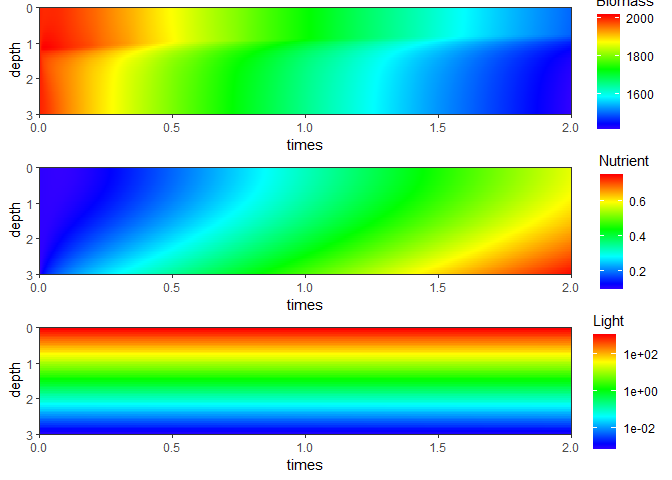

<!-- README.md is generated from README.Rmd. Please edit that file -->

# AlgalGame

<!-- badges: start -->

[](https://www.tidyverse.org/lifecycle/#experimental)
[](https://CRAN.R-project.org/package=AlgalGame)
<!-- [](https://ci.appveyor.com/project/bishun945/AlgalGame) -->
<!-- [](https://travis-ci.com/bishun945/AlgalGame) -->
<!-- badges: end -->

The goal of AlgalGame is to solve the ODEs created by Klausmeier and
Litchman (2001) and to simulate algal vertical profiles.

## Installation

You can install the released version of AlgalGame from Github with:

``` r
remotes::install_github("bishun945/AlgalGame")
```

## Example

This is a basic example which shows you how to use this pacakge.

Run the model by the default parameters:

``` r
library(AlgalGame)
res <- run_model()
```

Plot the result:

``` r
plot(res$gplot)
```



You can also plot the result by the function `ggimage` with add-on
contour texts:

``` r
ggimage(res$out, "Biomass", contour.text = TRUE)
```

 The
default paramters are shown as follows:

``` r
show_parms()
#>    Param   Value                                                         Desc
#> 1    Rin 1.0e+02                              sediment P concentration [ug/L]
#> 2      h 1.0e-02                    sediment-water column permeability  [1/m]
#> 3    Iin 1.4e+03                      Incoming light [umol photons m^-2 s^-1]
#> 4    abg 3.5e+00                     Background attenuation coefficient [1/m]
#> 5      a 1.0e-04 algal specific attenuation coefficient [m^-1 / (cells / ml)]
#> 6   vmax 1.0e+00                                         swimming speed [m/d]
#> 7      r 4.0e-01                                    maximum growth rate [1/d]
#> 8      m 4.0e-02                                              loss rate [1/d]
#> 9     KR 1.0e+00                            P half-saturation constant [ug/L]
#> 10    KI 5.0e+01      light half-saturation constant [umol photons m^-2 s^-1]
#> 11     Y 1.0e+03                      yield coefficient [cell ml^-1 / (ug/L)]
#> 12   e_r 0.0e+00                                     recycling coefficient []
#> 13    DR 1.0e+01                     eddy diffusion coefficient for R [m^2/d]
#> 14    Db 1.0e+01      eddy diffusion coefficient for b (same as `DR`) [m^2/d]
#> 15    Rs 1.0e+00                        minimum nutrient concentration [ug/L]
#> 16    Is 5.0e+01                 minimum light level [umol photons m^-2 s^-1]
```

## References

-   Klausmeier C A, Litchman E. Algal games: The vertical distribution
    of phytoplankton in poorly mixed water columns
    *J*
    . Limnology and Oceanography, 2001, 46(8): 1998-2007.

-   Presentation of [Algal
    Game](https://bishun945.github.io/presentation20201216/) in Chinese.
    The slide was made by [xaringan](https://github.com/yihui/xaringan).
