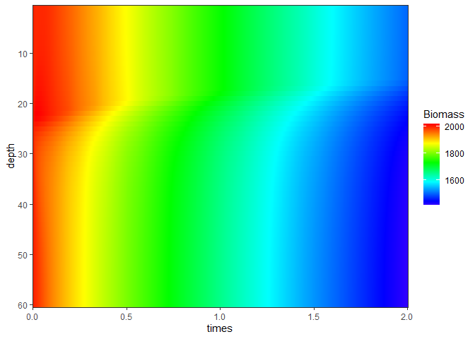

<!-- README.md is generated from README.Rmd. Please edit that file -->

# AlgalGame

<!-- badges: start -->
<!-- badges: end -->

The goal of AlgalGame is to solve the ODEs created by Klausmeier and
Litchman (2001) and to simulate algal vertical profiles.

## Installation

You can install the released version of AlgalGame from Github with:

``` r
remotes::install_github("bishun945/AlgalGame")
```

## Example

This is a basic example which shows you how to use this pacakge.

Run the model by the default parameters:

``` r
library(AlgalGame)
res <- run_model()
```

Plot the result:

``` r
plot(res$gplot)
```


You can also plot the result by the function `ggimage` with add-on
contour texts:

``` r
ggimage(res$out, "Biomass", contour.text = TRUE)
```



## References

-   Klausmeier C A, Litchman E. Algal games: The vertical distribution
    of phytoplankton in poorly mixed water columns
    *J*
    . Limnology and Oceanography, 2001, 46(8): 1998-2007.

-   Presentation of [Algal
    Game](https://bishun945.github.io/presentation20201216/) in Chinese.
    The slide was made by [xaringan](https://github.com/yihui/xaringan).
